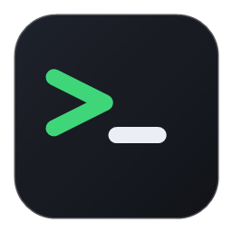

<div align="center">



# DevTerm

**A GPU-rendered, multi-pane developer terminal for Windows and Linux.**

A real terminal *application* — its own window, its own renderer, one PTY per pane —
not a multiplexer running inside another terminal.

[](https://github.com/p-arndt/devterm/actions/workflows/ci.yml)
[](https://github.com/p-arndt/devterm/releases)
[](#license)
[](rust-toolchain.toml)


[Install](#install) · [Quick start](#quick-start) · [Documentation](docs/) · [Roadmap](PLAN.md) · [Contributing](#contributing)

</div>

---

## What is DevTerm?

DevTerm is a native terminal built for developers who live in a multi-pane layout all day.
It renders the cell grid directly on the GPU (Direct3D 12 on Windows, Vulkan on Linux) and
runs a dedicated pseudo-terminal per pane — ConPTY on Windows, a native PTY on Linux — so
splits, tabs, and scrollback are first-class, not bolted on inside another emulator.

It is **not** a tmux clone or a webview wrapper. A core design goal is to eliminate the
half-rendered-frame flicker that plagues in-terminal multiplexers, by fully decoupling the
VT parser from a VSync-driven, damage-tracked renderer (see
[the anti-flicker architecture](PLAN.md#die-anti-flacker-architektur-lektion-aus-psmux)).

> **Status — v0.3.1.** Daily-usable. Milestones **M0** (walking skeleton) and **M1**
> (daily driver) are complete; **M2** (project-oriented: tabs, sessions, CLI) is in
> progress. See [`PLAN.md`](PLAN.md) for the full roadmap.

## Features

- 🪟 **True splits & tabs** — split side-by-side or stacked, nest freely, navigate with the
  keyboard or the mouse. Background tabs keep running.
- ⚡ **GPU cell renderer** — `wgpu` glyph atlas with a font-fallback chain (Nerd Font
  symbols, CJK), gamma-correct blending, and per-line damage tracking.
- 🎯 **No flicker** — parser/renderer decoupling, byte-burst coalescing, and
  Synchronized Output (DECSET 2026) support, so TUIs like `vim`, `htop`, and Claude Code
  never show partial frames.
- 🖱️ **Mouse & clipboard** — click-to-focus, drag-to-select, divider-drag resize, system
  clipboard copy/paste with bracketed paste.
- 📜 **Scrollback** — configurable history with wheel and keyboard scrolling.
- ⌨️ **Configurable keybindings** — a sensible default keymap plus a tmux-flavored preset;
  remap anything in `config.toml`.
- 🐚 **Your shell** — PowerShell 7, Windows PowerShell, cmd, Git Bash, or WSL on Windows;
  your login shell on Linux.
- 🎨 **Themes & live config** — `config.toml` with hot-reload (font, size, theme, shell,
  scrollback) and an in-app settings overlay.
- 🔦 **Floating scratch terminal** — a centered, toggleable pane for quick one-off commands.
- 📦 **Easy install** — Windows installer with a built-in self-updater, plus standalone
  binaries for Windows and Linux.

## Install

### Windows

Grab the latest from the [**Releases**](https://github.com/p-arndt/devterm/releases) page:

- **`devterm-*-setup.exe`** — the friendly installer (Start Menu shortcut, optional desktop
  icon and Add-to-PATH, uninstaller). Recommended. Updates itself in place.
- **`devterm-x86_64-pc-windows-msvc.exe`** — a standalone, self-contained binary; just run it.

### Linux

Download the `devterm-*-x86_64-unknown-linux-gnu.tar.gz` archive from
[Releases](https://github.com/p-arndt/devterm/releases), extract, and run `./devterm`.
You'll need a Vulkan driver and a few windowing libraries — see the
[Linux prerequisites](docs/README.md#linux-prerequisites).

### From source

```sh
git clone https://github.com/p-arndt/devterm
cd devterm
cargo run --release -p devterm-app
```

Requires a Rust toolchain (edition 2024, rustc ≥ 1.96 — pinned in
[`rust-toolchain.toml`](rust-toolchain.toml)) and a working GPU. On Linux, install the
[system dependencies](docs/README.md#linux-prerequisites) first.

## Quick start

1. Launch it — you get one full-window pane running your default shell.
2. `Ctrl+Shift+H` splits **side by side**; `Ctrl+Shift+S` splits **stacked**. Focus moves
   to the new pane.
3. `Ctrl+Shift+<arrow>` moves focus; `Alt+Shift+<arrow>` slides the focused pane's border.
4. Click a pane to focus, drag to select; `Ctrl+Shift+C` copies, `Ctrl+Shift+V` pastes.
5. `Ctrl+Shift+N` opens a new tab; `Ctrl+Tab` cycles tabs.
6. `Ctrl+,` opens the settings overlay; `Ctrl+Shift+W` closes the focused pane.

Full shortcut list → [**keybindings.md**](docs/keybindings.md).

## Documentation

| Doc | What's in it |
|---|---|
| [**usage.md**](docs/usage.md) | Day-to-day: panes, splits, focus, scrolling, selection, copy/paste. |
| [**keybindings.md**](docs/keybindings.md) | Every default shortcut, the tmux preset, chord syntax, and remapping. |
| [**configuration.md**](docs/configuration.md) | The complete `config.toml` reference — shells, themes, fonts, hot-reload. |
| [**PLAN.md**](PLAN.md) | Architecture, tech-stack rationale, and the milestone roadmap. |

## Architecture

DevTerm is a Cargo workspace with a strict one-way dependency direction —
`app → {render, term, pty, config, plugin} → core`. `core` knows nothing about wgpu,
winit, or ConPTY, which keeps the domain logic pure and fully unit-testable.

| Crate | Responsibility | Status |
|---|---|---|
| [`devterm-core`](crates/devterm-core) | Domain model: panes, layout tree, focus. **No I/O.** | ✅ |
| [`devterm-pty`](crates/devterm-pty) | PTY/ConPTY: spawn, reader/writer threads, lifecycle. | ✅ |
| [`devterm-term`](crates/devterm-term) | Terminal emulation (wraps `alacritty_terminal`). | ✅ |
| [`devterm-render`](crates/devterm-render) | `wgpu` renderer: cell grid, glyph atlas, splits. | ✅ |
| [`devterm-config`](crates/devterm-config) | Config, keymaps, themes, project layouts. | ✅ |
| [`devterm-app`](crates/devterm-app) | Binary `devterm`: window, input, chrome, IPC. | ✅ |
| [`devterm-cli`](crates/devterm-cli) | Binary `dt`: control a running instance. | 🚧 M2 |
| [`devterm-plugin`](crates/devterm-plugin) | WASM plugin host (`wasmtime`). | 🚧 M3 |

The terminal grid is rendered by a custom `wgpu` pipeline; `egui` is used **only** for the
window chrome (tabs, palette, dialogs), never for the grid. Terminal emulation is built on
the battle-tested `alacritty_terminal` crate — DevTerm does **not** ship its own VT parser.

## Development

DevTerm uses [`just`](https://github.com/casey/just) as a task runner:

```sh
just run            # run the app (debug build)
just run-release    # run optimized (use this to judge performance)
just test           # unit + property tests
just ci             # fmt-check + clippy + test — the full local gate
just --list         # all recipes
```

Or drive Cargo directly:

```sh
cargo run -p devterm-app                                    # launch
cargo test --workspace --all-features                       # tests
cargo clippy --all-targets --all-features -- -D warnings    # lint
cargo fmt --all --check                                     # format check
```

CI runs fmt, clippy, tests (on Windows **and** Linux), and `cargo-deny` (license +
advisory audit) on every push and PR.

## Roadmap

- **M0 — Walking skeleton** ✅ — window, ConPTY, emulation, GPU grid, input.
- **M1 — Daily driver** ✅ — splits, resize, scrollback, selection, clipboard, font
  fallback, shells, themes, configurable keybindings, anti-flicker.
- **M2 — Project-oriented** 🚧 — tabs ✅, session persistence, `devterm.yml` project
  profiles, command palette, `dt` CLI + IPC, quake-mode hotkey.
- **M3 — Plugin platform** — `wasmtime` plugin host, statusbar/palette/pane-listener APIs,
  scrollback search.
- **M4 — Polish & reach** — ligatures, OSC 8 hyperlinks, SSH panes, macOS builds.

Full detail in [`PLAN.md`](PLAN.md).

## Contributing

Issues and pull requests are welcome. Before opening a PR, please run `just ci` so fmt,
clippy, and the tests pass locally. New logic in `devterm-core` should come with unit or
property tests — the domain layer is deliberately I/O-free to keep it fully testable.

## License

Dual-licensed under either of

- MIT license ([LICENSE-MIT](LICENSE-MIT) or <https://opensource.org/licenses/MIT>)
- Apache License, Version 2.0 ([LICENSE-APACHE](LICENSE-APACHE) or <https://www.apache.org/licenses/LICENSE-2.0>)

at your option.
